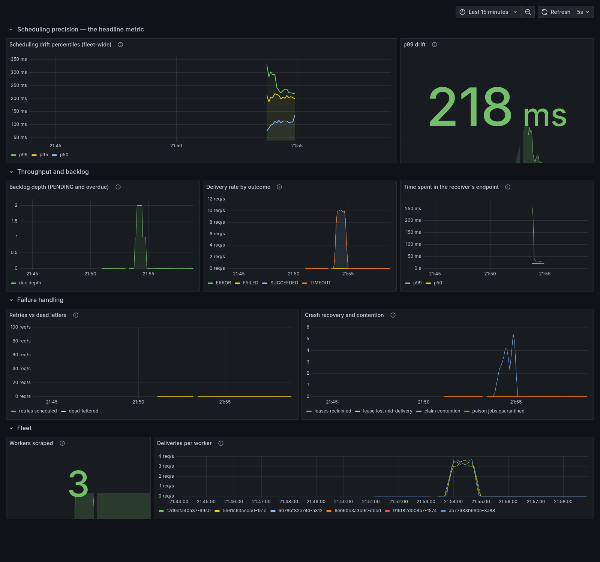
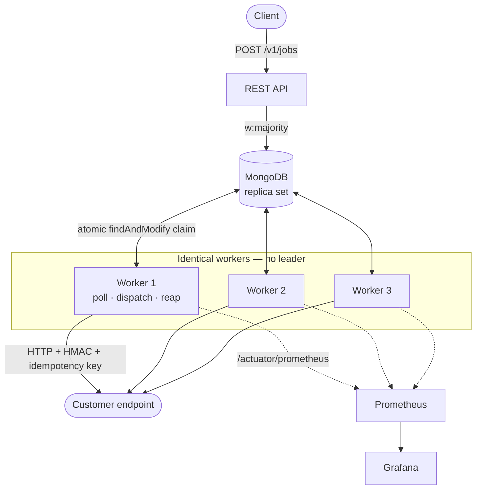

# Chronos

A distributed job and webhook scheduler. Multiple identical workers deliver HTTP webhooks at a
precise time with at-least-once guarantees, lease-based crash recovery, exponential backoff and a
replayable dead-letter queue.

**Java 21 · Spring Boot 4.1 · MongoDB 7 · Docker · Kubernetes · Prometheus + Grafana**

```bash
docker compose up -d --build --scale worker=3
```

Three workers, no leader, no per-instance configuration. Dashboard at <http://localhost:3000>.

**Live instance:** <https://chronos-scheduler-o20q.onrender.com/actuator/health>

```bash
curl -i https://chronos-scheduler-o20q.onrender.com/v1/jobs        # 401 - auth is enforced
```

A free instance, so it sleeps after ~15 minutes idle and the first request takes 30-60s to wake it.
A sleeping scheduler fires nothing — the drift numbers below come from the local three-worker stack,
not from this. See [docs/RENDER_DEPLOY.md](docs/RENDER_DEPLOY.md) for what the deployment does and
does not demonstrate.

---

## Measured, not claimed

| | |
|---|---|
| **p99 scheduling drift** | **236 ms** (p50 106 ms) across 3 workers |
| **Job loss under chaos** | **zero** — 2 of 5 workers SIGKILLed mid-run, 4,000 jobs |
| **On Kubernetes** | **zero loss** again, pods SIGKILLed and rescheduled by the ReplicaSet controller |
| **Autoscaling** | HPA scales on **queue depth**, not CPU — and the run found a node too small to honour it |
| **Duplicate rate** | **0.05%**, every one carrying a stable idempotency key |
| **Claim query** | **1.2 ms** at 200K jobs — 99.2% faster than a naive index |
| **Creation throughput** | ~24,000 jobs/min, 0 failures, p95 72 ms |
| **Tests** | 172, including 1,000 jobs × 10 concurrent workers |

Full numbers and how to reproduce them: **[BENCHMARKS.md](BENCHMARKS.md)** · **[CHAOS.md](CHAOS.md)**



---

## How it works



Every worker runs the same three loops — **poll** every 200ms, **dispatch** on virtual threads,
**reap** expired leases every 10s. There is no master. Coordination is entirely one atomic
`findAndModify` against MongoDB, which is what lets you scale by adding containers and reconfiguring
nothing.

### The claim

```java
Query query = new Query(Criteria.where("status").is(PENDING).and("nextRunAt").lte(now))
        .with(Sort.by(ASC, "nextRunAt"));

Update update = new Update()
        .set("status", CLAIMED).set("lockedBy", workerId)
        .set("lockExpiresAt", now.plus(lease))
        .inc("claimCount", 1);            // pickups — NOT delivery attempts

mongoTemplate.findAndModify(query, update, options().returnNew(true), Job.class);
```

Two workers racing the same document: one wins the write, the other's filter no longer matches.
No transaction, no lock service, no ZooKeeper.

**The claim is only half of it.** It stops two workers *starting* a job; it does nothing about a
slow worker whose lease expired mid-delivery *finishing* one that has since been reassigned. So
every terminal write re-asserts ownership, and a worker that lost its lease discards its result
instead of overwriting whoever owns the job now. That is the difference between a duplicate delivery
(fine, and expected) and a corrupted schedule (not fine, and silent).

---

## Verifying a webhook

Every delivery carries:

```http
X-Idempotency-Key:   job_<jobId>_run_<scheduledFor-epochMillis>
X-Webhook-Timestamp: 1735689600
X-Webhook-Signature: v1=<hex(HMAC_SHA256(secret, timestamp + "." + rawBody))>
```

```python
import hashlib, hmac, time

def verify(secret, timestamp, signature, raw_body, tolerance=300):
    if abs(time.time() - int(timestamp)) > tolerance:
        return False                                   # replay: valid signature, stale request
    expected = "v1=" + hmac.new(
        secret.encode(), f"{timestamp}.".encode() + raw_body, hashlib.sha256
    ).hexdigest()
    return hmac.compare_digest(expected, signature)    # constant time, not ==
```

Two things that matter more than they look: `compare_digest` rather than `==`, because `==`
short-circuits on the first differing byte and turns forgery into a few thousand requests; and the
timestamp check, because a correctly-signed two-hour-old request is still a replay.

**Deduplicate on `X-Idempotency-Key`.** At-least-once means duplicates happen — the key is what
makes them safe. Every retry of one firing repeats it.

---

## API

```
POST   /v1/jobs                     create (ONE_TIME or CRON)
GET    /v1/jobs/{id}                detail
POST   /v1/jobs/{id}/pause          take out of circulation
POST   /v1/jobs/{id}/resume
POST   /v1/jobs/{id}/trigger        fire now → 201, a NEW job (schedule untouched)
DELETE /v1/jobs/{id}                cancel (best-effort; in-flight delivery completes)

GET    /v1/dead-letters
POST   /v1/dead-letters/{id}/replay → 201, a new job cloned from the snapshot

GET    /actuator/health · /actuator/prometheus
```

Errors are RFC 7807 `application/problem+json`. Authentication is `Authorization: Bearer <key>`;
only a hash of the key is ever stored.

```bash
curl -X POST localhost:8080/v1/jobs -H 'Content-Type: application/json' -d '{
  "name": "send-trial-expiry",
  "schedule": { "type": "ONE_TIME", "runAt": "2026-08-04T09:00:00Z" },
  "target":   { "url": "https://example.com/hooks/trial", "payload": { "userId": 42 } }
}'
```

`trigger` returns a *new* job rather than mutating the existing one — for a recurring job the
one-line implementation (`nextRunAt = now`) silently re-bases the whole series, turning a daily 09:00
job into a daily "whenever someone last clicked trigger" job.

---

## Design decisions

Seven ADRs, one page each: **[docs/adr](docs/adr/)**

The three worth reading first:

- **[Why the idempotency key comes from the scheduled time](docs/adr/0006-idempotency-key-derivation.md)** —
  the subtlest decision here. Deriving it from the obvious field breaks every retry, silently, with
  no failing test.
- **[Lease-verified write-back](docs/adr/0003-lease-based-locking.md)** — why the atomic claim alone
  is not enough.
- **[Polling vs change streams](docs/adr/0004-polling-with-change-stream-wakeup.md)** — with the
  measurement showing when the optimisation is worth it and when it is not.

---

## Security

- **SSRF guard** — every address a target resolves to is checked against an explicit CIDR denylist,
  at registration *and* again at delivery. Covers IPv6 ULA (`fc00::/7`), CGNAT (`100.64/10`) and
  `0.0.0.0/8`, all of which Java's `InetAddress.isSiteLocalAddress()` family misses.
- **HMAC-SHA256** over the exact transmitted bytes, with a timestamp inside the signed material.
- **Tenant isolation** — every query is tenant-scoped; a cross-tenant read returns 404, not 403.
- **Header denylist** so a caller cannot shadow the signature headers.
- **Per-tenant rate limiting** on job creation.

**Known limitation, stated rather than hidden:** the DNS-rebinding window is narrowed but not
closed. After we resolve and approve an address, `HttpClient` performs its own resolution before
connecting, and Java exposes no connection-time hook to bind the two. Closing it properly means
pinning the connection to the validated IP with SNI configured. See
[`SsrfGuard`](src/main/java/dev/pranay/chronos/security/SsrfGuard.java).

---

## Running it

```bash
docker compose up -d --build --scale worker=3   # full stack
./gradlew test                                  # 172 tests (needs Docker for Testcontainers)
./load/chaos.sh 4000 40 5 2                     # kill workers, assert no loss
./load/drift-compare.sh 300 2000                # change streams on vs off
```

| | |
|---|---|
| API | any worker, port 8080 (internal) |
| Grafana | <http://localhost:3000> |
| Prometheus | <http://localhost:9090> |
| MongoDB | `mongodb://localhost:27017/chronos?directConnection=true` |

The demo stack sets `allow-private-targets=true` and `require-api-key=false` — every address inside
a compose network is RFC 1918 private, which is exactly what the SSRF guard blocks. **Both default
to the secure value and must stay there in a real deployment.**

Deploying it somewhere:

- **[docs/RENDER_DEPLOY.md](docs/RENDER_DEPLOY.md)** — free, no card, one Blueprint click. Note the
  sleeping-instance caveat: a free instance that has slept isn't firing anything, and that section
  explains what the design does about it.
- **[docs/DEPLOYMENT.md](docs/DEPLOYMENT.md)** — AWS App Runner + Atlas M10, the real one.
- **[docs/FLY_DEPLOY.md](docs/FLY_DEPLOY.md)** — Fly.io, abandoned. Kept for the debugging
  post-mortem: a TLS error I diagnosed confidently and wrongly, what the flawed experiment was, and
  the single contradicting observation that finally broke it. The real cause was an Atlas IP access
  list containing one entry.

---

## On Kubernetes

The chaos test above kills containers and restarts them from a bash script. **[k8s/](k8s/)** runs the
same 4,000-job test on a cluster, where pods are deleted and the ReplicaSet controller does the
recovery — nothing in the recovery path belongs to the harness.

```bash
docker build -t chronos-scheduler:local .
kind create cluster --name chronos && kind load docker-image chronos-scheduler:local --name chronos
kubectl apply -f k8s/00-namespace.yaml -f k8s/10-mongo.yaml -f k8s/11-mongo-init.yaml
kubectl apply -f k8s/40-sink.yaml -f k8s/20-worker.yaml -f k8s/30-scaling.yaml

./k8s/chaos-k8s.sh 4000 40 2 kill      # SIGKILL — the crash case
./k8s/chaos-k8s.sh 4000 40 2 evict     # SIGTERM — the rolling-deploy case
./k8s/hpa-demo.sh                      # 40,000-job backlog, watch it scale
```

### Killing pods two ways gives different answers

| | `kill` — SIGKILL, `--grace-period=0 --force` | `evict` — SIGTERM, plain `delete pod` |
|---|---|---|
| Distinct keys delivered | **4000 / 4000** | **4000 / 4000** |
| **Duplicate keys** | **5** | **0** |
| Execution records written | 3998 | 4000 |

Same cluster, same command, same job count. The only difference is whether `@PreDestroy` ran — so
that duplicate column is graceful shutdown measured rather than asserted.

It also means **`kubectl delete pod` is not a crash test.** It sends SIGTERM and waits for the drain,
which exercises the rolling-deploy path. Reporting that as "survived worker death" tests the wrong
thing; the crash case needs `--grace-period=0 --force`.

The third row is the one worth staring at. Under SIGKILL, Chronos wrote **3,998 execution records
for 4,005 actual deliveries** — seven deliveries genuinely happened that the system has no record of,
because pods died between the HTTP call returning and the record being written. Assertions run
against the *receiver's* journal for exactly this reason; counting our own bookkeeping would have
reported loss that did not occur.

### Three probes, because one would kill the fleet

| Probe | Endpoint | Mongo? | Answers |
|---|---|---|---|
| `startupProbe` | `/actuator/health/liveness` | no | "still booting, don't judge me yet" |
| `livenessProbe` | `/actuator/health/liveness` | **no** | "restart me" |
| `readinessProbe` | `/actuator/health/readiness` | **yes** | "send me traffic" |

Boot's aggregate `/actuator/health` includes Mongo. Point a liveness probe at it and one database
blip fails every replica simultaneously, Kubernetes kills the whole fleet, and each replacement fails
the identical probe against the identical unavailable database — a restart storm produced by the
health check rather than the fault. That is not hypothetical; it took the Render deployment of this
project down for fifteen minutes while the app itself was serving fine.

Readiness *should* include Mongo: a worker that cannot reach the database should leave the Service.
It does not get restarted, and the poller keeps retrying, so it rejoins on its own.

### Autoscaling on backlog, not CPU

CPU is the obvious signal and the wrong one — a worker polling every 200ms and dispatching on virtual
threads sits parked on network I/O, so throughput climbs while utilisation stays flat. The HPA scales
on `scheduler_jobs_due_depth` (jobs already late) via Prometheus + prometheus-adapter. No
metrics-server needed; the only metric is external.

```
TIME   HPA READING   DESIRED  READY
0s     0             2        2
26s    17376500m     2        2     ← 40,000 overdue jobs seeded
38s    17376500m     6        2     ← autoscaler reacts
55s    3344400m      10       5     ← desired 10, five actually running
199s   2956300m      10       0     ← whole fleet down
336s   2663200m      10       0
```

**The autoscaler worked. The cluster could not honour it, and the result was worse than not scaling
at all.** Desired went to `maxReplicas: 10`; ready never exceeded 6 and repeatedly hit zero. Ten
workers at a 768Mi limit want 7.7GB on a 7.6GB node already running MongoDB, Prometheus, the adapter
and the sink — so the JVMs grew into their limits under load and the kernel started killing them.
The backlog crawled from 32,773 to 26,000 in five and a half minutes, far slower than the two
replicas it started with.

This is the failure mode the manifest's own comment predicted without measuring: **`maxReplicas` is
a hardware statement, not an ambition.** Set it above what the nodes can actually run and the
autoscaler faithfully requests a fleet that thrashes. On a single-node kind cluster of this size the
honest ceiling is around 4–5 workers, not 10.

**Two ways to get it wrong, neither of which errors.** Every worker exports the *fleet-wide* depth
tagged with its own worker id — not a per-pod value. `sum()` in the adapter reports `depth × replicas`,
so adding a worker to drain a backlog makes the metric go *up*, which adds workers: a loop that pins
the deployment at `maxReplicas`. And `type: Pods` in the HPA averages before dividing, giving
`currentReplicas × depth / target`, which over-scales by the replica count and compounds. Use `max()`
and `type: External` with `AverageValue`.

**[k8s/README.md](k8s/README.md)** has the rest — including a measured finding that the node's wall
clock steps backwards 43–81ms every 30 seconds, which made an assertion fail in a way the code makes
structurally impossible, and two bugs in the test harness itself.

---

## What this doesn't do

- **Exactly-once delivery.** Impossible over an unreliable network; see
  [ADR 0002](docs/adr/0002-at-least-once-delivery.md).
- **Global rate limiting or circuit breaking.** Both are per-worker, so limits multiply by fleet
  size. Deliberate — centralising them puts a round-trip on the hot path.
- **`POST /v1/tenants` is unauthenticated.** A bootstrap compromise; real deployments put it behind
  an admin credential or an internal-only network.
- **Sharding.** Single replica set. Scaling past it means sharding by `tenantId`.
- **Autoscale the database.** Every replica claims against one MongoDB replica set with a single
  atomic `findAndModify`. Past some worker count, more replicas mean more contention on the same
  document range rather than more throughput — so the HPA's `maxReplicas` is a real ceiling, and the
  right value depends on hardware not measured here.
- **React to short spikes.** Queue depth counts jobs *already* late, and the control loop adds
  ~20–30s (gauge refresh + scrape + HPA sync) before a backlog is even visible, plus 40–70s of pod
  startup. Good for load lasting minutes; blind to a ten-second burst.
